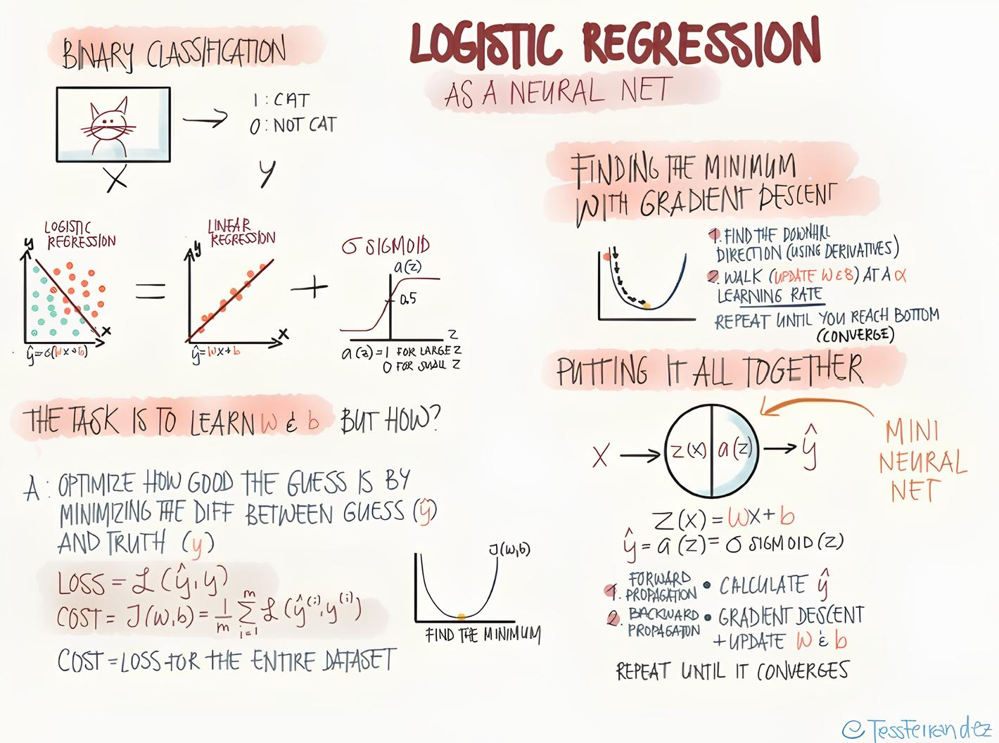

# logistic-regression-model-py
Simple logistic regression model using raw python and numpy.

## Logistic Regression in a nutshell.

### Forward propagation
For one training example $x = (x_1, ..., x_n) $ of dimension n, the forward propgation is:

$ z = dot(w, x) + b $

$ a = sigmoid(z) $

$ L = -(ylog(a) + (1-y)log(1-a)) $

### Backpropagation
Training the model means updating the weights and biases, W and b, using the gradient of the
loss with respect to these parameters.

At each step, we need to calcualate: 

####  $ \frac{dL}{dw} $, $ \frac{dL}{db}$

We can use the cain rule:

#### Chain rule

Let $u(x)$ and $v(x)$ be two function.

We want the derivative of the product of u and v:

$\frac{dvu}{dx} $ = $\frac{dv}{dx} u + \frac{du}{dx} $ v

in another notation:

$(v(x)*u(x))'$ = $v'(x) * u(x) + v(x) * u'(x)$